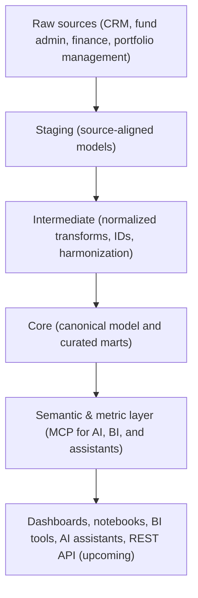

# AMOS

     

---
**Overview** | [Starter](https://github.com/open-amos/starter) | [Core](https://github.com/open-amos/core) | [Source Example](https://github.com/open-amos/source-example) | [Dashboard](https://github.com/open-amos/dashboard-example)

---

# AMOS Overview

> **Project status:** AMOS is currently in an early proof-of-concept stage (v0.1.0).  
> Core architecture, models, and patterns are functional but still evolving.  
> Expect incomplete coverage and active iteration across components.

## What is AMOS?

AMOS (the **Asset Management Operating System**) is a modern, open-source data stack purpose-built for private markets. It helps both emerging and established funds reduce reporting time, improve transparency, and prepare for AI-driven analysis. AMOS provides the core infrastructure to turn fragmented operational data from multiple sources into a consistent, intelligent foundation for analysis and automation:

- Automated pipelines to extract and centralize data from multiple source systems (CRM, portfolio management, fund admin, accounting systems, etc.)
- Canonical data model for funds, portfolios, deals, accounts, and entities   
- Curated data marts and metrics for reporting and live dashboards 
- Modular, cloud-agnostic architecture for flexible deployment   
- MCP server integration — exposes AMOS data and semantics to AI assistants and notebooks using the [Model Context Protocol](https://modelcontextprotocol.io)   
- REST API — programmatic access to canonical data and metrics for external systems

AMOS is **open-source**, **cloud-agnostic**, and **vendor-independent**, giving funds full control of their architecture while enabling shared data standards across the industry. 

## Who It’s For

- **Emerging funds** looking for a lightweight but robust data foundation to support efficient operations, reliable reporting, and AI-readiness from day one  
- **Established funds** seeking to modernize legacy systems and simplify complex data architectures without vendor lock-in  

## Why AMOS

- **Unified data foundation** — one canonical model and shared vocabulary across funds and systems  
- **Faster time to insight** — prebuilt transformations, marts, and dashboards accelerate delivery  
- **Architectural independence** — open, modular components that evolve with your strategy  

## Architecture Overview

## Project Components

- **Starter** — Thin orchestrator that ties AMOS Core and Source Example together
  → [Read more](../starter)  
- **Core** — Canonical dimensional model and curated marts  
  → [Read more](../core)  
- **Source Example** — Sample connectors and mapping patterns  
  → [Read more](../source-example)  
- **Dashboard** — Example analytics and KPI dashboards built on AMOS Core  
  → [Read more](../dashboard-example)
- **REST API** — programmatic access to canonical data and metrics for external systems (coming soon)
- **MCP Server** — exposes AMOS data and semantics to AI assistants and notebooks (coming soon)
- **AMOS Utility Apps** - Prebuilt apps for common use cases, eg data extraction, reconciliation, report generation, and more (coming soon)

## Getting Started

1. Start with the [AMOS Starter](../starter) to spin up the full stack.  
2. Explore the canonical data model in [AMOS Core](../core).  
3. Review source mappings and transformation patterns in [Source Example](../source-example).  
4. Launch the [Dashboard](../dashboard-example) to explore metrics and visualizations.  

## Documentation

Setup guides, architecture details, and API references:  
`https://docs.amos.tech`

## Community & Support

- Documentation: `https://docs.amos.tech`  
- Issues: Use GitHub Issues within each subproject  
- Contributions: PRs welcome for connectors, mappings, transformations, tests, and documentation
